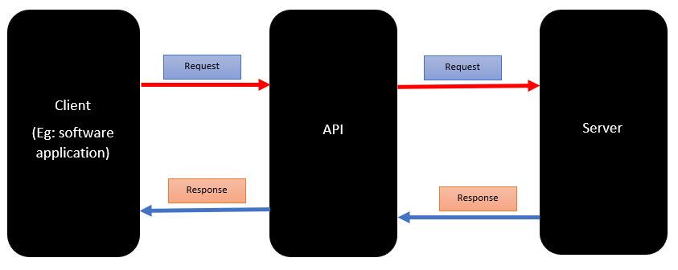

# APIs

## What are APIs?

APIs stand for application programming interfaces.
APIs are a way for 2 or more programs to communicate with each other, all the while using 
set definitions and protocols.

APIs make it easier for developers to create these complex applications by defining **how** these programs interact with
each other.

These different programs can share both data and functionality when they are connected with APIs.
Time and effort is saved by developers by using these APIs to make applications that use **pre-existing** code and services.

The reason why APIs are so popular, is because it is very quick and simple for developers to create **robust, feature-rich apps**.
In addition to this, there is no need to start from scratch as using APIs lets developers use outside services into their
own applications, allowing for new features and functionalities to be added.

## Diagram to showcase the data transfer process in API communication

## What are REST APIs? What makes an API RESTful?

REST API is an interface in which 2 computer systems use to exchange information **securely**
over the internet, RESTful APIs use HTTP requests to access and use data.

REST is generally preferred over other technologies due to the fact that REST uses
less bandwidth, making it very efficent in the internet usage department, these APIs can also be built
with languages such as JavaScript or Python.

An API that is restful is when the API sticks to a set of principles known as **REST**.

The characteristics that define a RESTFUL API are:
* Client - Server architecture - where the client sends requests to server, and it responds back with data
* Statelessness - each request sent will have all the necessary information for the server to process it, client information not stored between requests
* Cacheability - responds can be cached to improve performance
* Uniform Interface - separates the client from the server's implementation (allows for scalability, flexibility, security)
* Layered System - ach layer has a specific function and does not know about the internal workings of other layers

## HTTP

HTTP stands for Hypertext Transfer Protocol.

HTTP is a protocol that defines how web browsers and servers communicate with each other.

Used to transfer data over the web and is the ultimate foundation of the web.

## HTTP request and response structure

