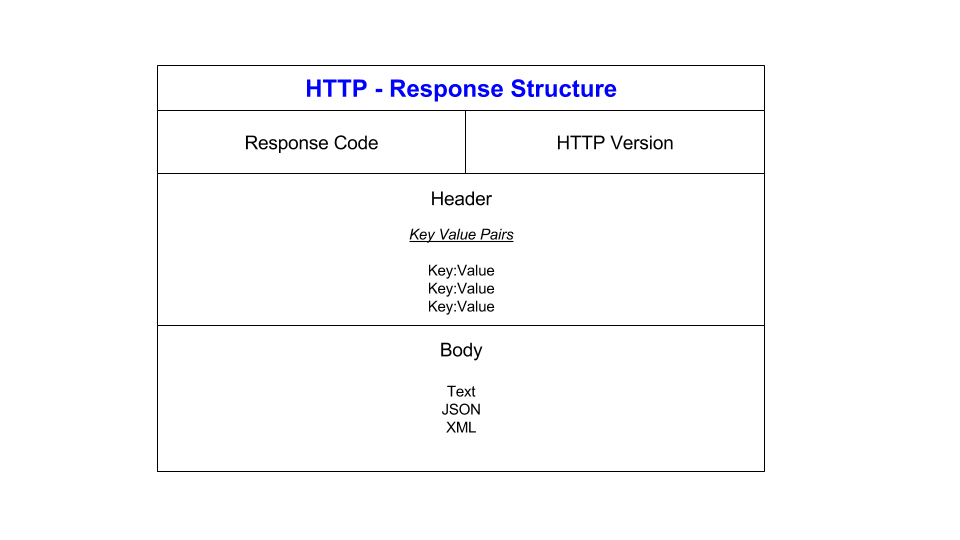

# APIs

## What are APIs?

APIs stand for application programming interfaces.
APIs are a way for 2 or more programs to communicate with each other, all the while using 
set definitions and protocols.

APIs make it easier for developers to create these complex applications by defining **how** these programs interact with
each other.

These different programs can share both data and functionality when they are connected with APIs.
Time and effort is saved by developers by using these APIs to make applications that use **pre-existing** code and services.

The reason why APIs are so popular, is because it is very quick and simple for developers to create **robust, feature-rich apps**.
In addition to this, there is no need to start from scratch as using APIs lets developers use outside services into their
own applications, allowing for new features and functionalities to be added.

## Diagram to showcase the data transfer process in API communication

The client (mobile app/website) will send a request to the API.

The API will process this request and send a request to the server, which will retrieve or modify this data.

After this,  the server will process the request and send a response back to the API, which in turn also sends a response back to the client.

Generally these request and response messages are formatted with the HTTP protocol which we will cover later on.

## What are REST APIs? What makes an API RESTful?

REST API is an interface in which 2 computer systems use to exchange information **securely**
over the internet, RESTful APIs use HTTP requests to access and use data.

REST is generally preferred over other technologies due to the fact that REST uses
less bandwidth, making it very efficient in the internet usage department, these APIs can also be built
with languages such as JavaScript or Python.

An API that is restful is when the API sticks to a set of principles known as **REST**.

The characteristics that define a RESTFUL API are:
* Client - Server architecture - where the client sends requests to server, and it responds back with data
* Statelessness - each request sent will have all the necessary information for the server to process it, client information not stored between requests
* Cacheability - responds can be cached to improve performance
* Uniform Interface - separates the client from the server's implementation (allows for scalability, flexibility, security)
* Layered System - each layer has a specific function and does not know about the internal workings of other layers

## HTTP

HTTP stands for Hypertext Transfer Protocol.

HTTP is a protocol that defines how web browsers and servers communicate with each other.

Used to transfer data over the web and is the ultimate foundation of the web.

## HTTP request and response structure

HTTP request is a message that a client sends to a server to request information.
The HTTP request usually consists of a request line, headers, and a message body.

As we can see in the diagram the verb, url and version make up this thing called the **request line**

**Headers** have additional data about the request, these vary from content type to authentication credentials.

The **message body** has data that client wants to send to the server, varies from JSON payload to binary data.
Once server gets the request, it processes it and sends a response back to client with the requested infromation.

HTTP response is message that server sends to client in response to HTTP request.
HTTP Request consists of response line(as we can see in the diagram), headers, and message body.

**Response line** consists of response code and version. 

**Response code** shows if request was successful or if an error was encountered.

**Headers** have the data about the response varying from content type, server name and cache settings. 

**Message body** has the requested data eg: web page.

## HTTP Verbs

There are 5  used HTTP verbs:

* **GET** - Retrieve information from server
  * can be repeated without any changes to the server state
*  **POST** - data submitted is processed by a server
  * Unlike GET, POST requests can modify server resources and change the server state
* **PUT** - Updates a resource on the server
  * used to update stuff like documents, images, other files
    * PUT modifies existing resources
* **DELETE** - deletes a resource on the server
  * server will respond with a status code showing if the resource was successfully deleted
* **PATCH** - Partially updates a resource on the server
  * PATCH is similar to PUT, but instead of replacing the entire resource, the only modify specific parts
  * The request body will have the changes that will be made to the resource
  * server will apply those changes
